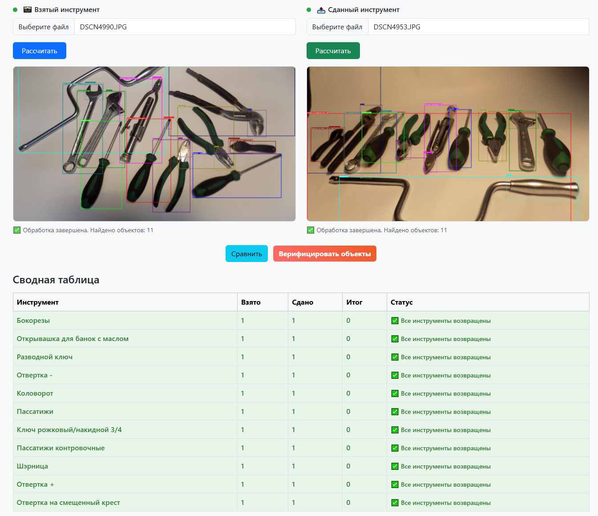
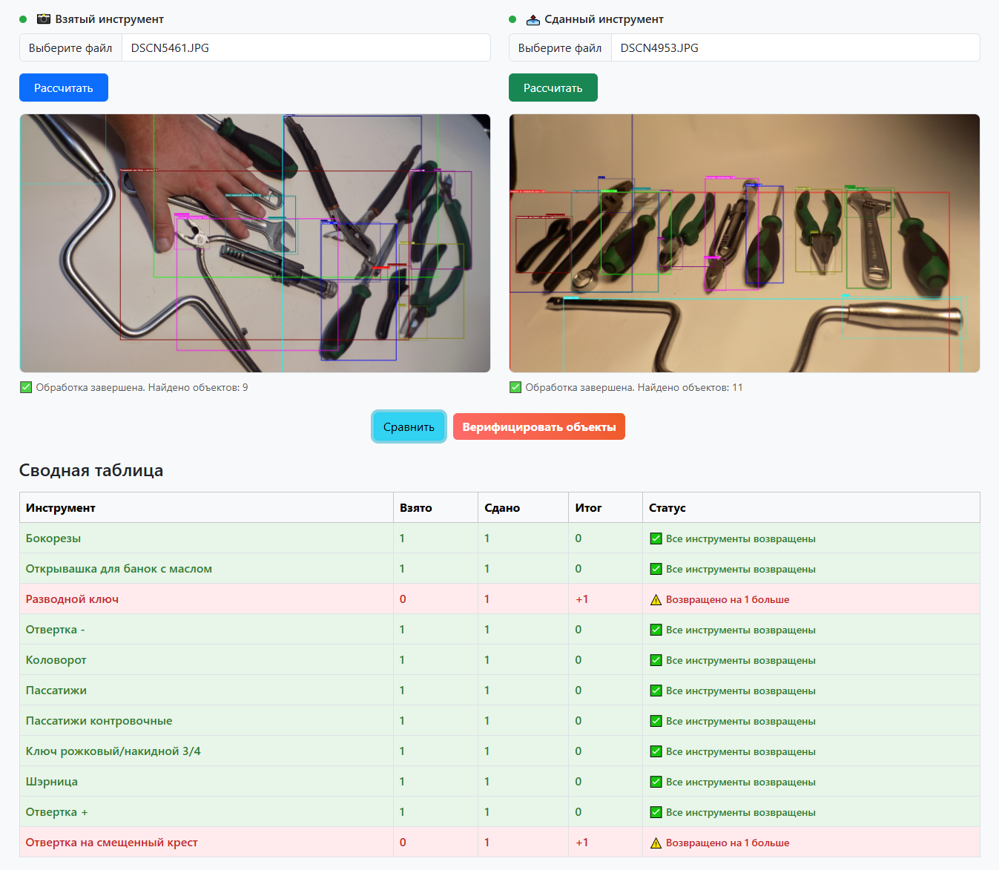
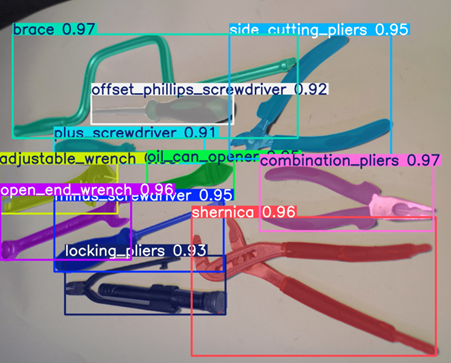
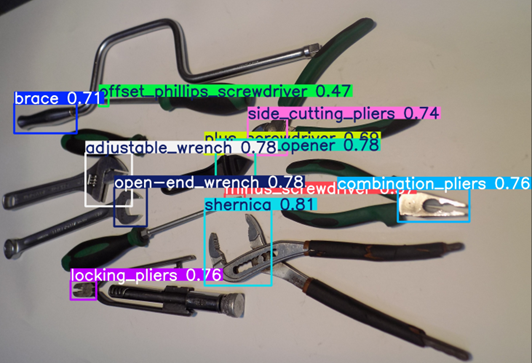

# Детекция инструментов для АФЛТ-Системс

Сервис компьютерного зрения для автоматической детекции и верификации инструментов на изображениях.

## Описание работы сервиса

### 🔍 Основные возможности:
- **Детекция инструментов** - автоматическое распознавание инструментов на изображениях
- **Верификация объектов** - сравнение взятых и возвращенных инструментов
- **Пакетная обработка** - массовая обработка нескольких изображений
- **Идентификация** - проверка соответствия конкретных инструментов

### 📊 Рабочий процесс:
1. **Загрузка изображений** - пользователь загружает фото взятых и возвращенных инструментов
2. **Автоматическая детекция** - нейросеть определяет инструменты и их расположение
3. **Сравнение** - система анализирует разницу между взятыми и возвращенными инструментами
4. **Верификация** - проверка соответствия конкретных инструментов через сравнение изображений
5. **Формирование отчета** - таблица с итогами проверки и статусами инструментов

### 🛠 Поддерживаемые инструменты:
- Отвертка (-, +, на смещенный крест)
- Коловорот
- Пассатижи (обычные и контровочные)
- Шэрница
- Разводной ключ
- Ключ рожковый/накидной
- Бокорезы
- Открывашки для банок с маслом


## Запуск через Docker

### Требования:

**Windows 11:**
- Docker Desktop
- Включённый WSL2 и Linux-дистрибутив (Ubuntu рекомендуем)
- Для GPU: в Docker Desktop включить Use the WSL 2 based engine и Use integrated GPU (если доступно), установлены драйверы NVIDIA и NVIDIA Container Toolkit в WSL2-дистрибутиве

**Ubuntu 22.04+:**
- Установлен Docker Engine
- Для GPU: установлен NVIDIA Container Toolkit (NCTK)

### Запуск:

**С поддержкой GPU:**
```bash
docker compose -f docker-compose.yml -f docker-compose.gpu.yml build
docker compose -f docker-compose.yml -f docker-compose.gpu.yml up -d
```

**Без поддержки GPU:**
```bash
docker compose build
docker compose up -d
```

Web:
http://127.0.0.1:8000/

Swagger:
http://127.0.0.1:8000/docs


## Примеры работы

### Примеры работы интерфейса обнаружения и сопоставления инструментов


*Пример когда все инструменты возвращены*



*Пример когда возвращено на 2 инструмента больше*


*Пример когда возвращено на 1 инструмент меньше*

### Примеры работы интерфейса



*Результат работы модели сегментации инструментов*



*Результат работы модели детекции кончиков инструментов*

